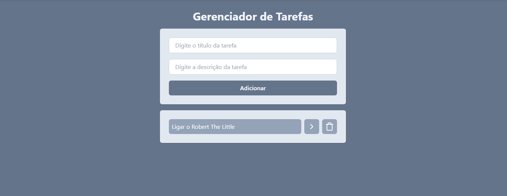

# Gerenciador De Tarefas

Este projeto é um **Gerenciador de Tarefas** desenvolvido utilizando apenas React. A aplicação permite que você organize e gerencie as tarefas que precisa realizar no seu dia a dia de maneira prática e intuitiva. <br>



## Índice

- [Funcionalidades:](#funcionalidades:)
- [Terminal](#terminal)
- [Dependências](#dependências)
- [Extensões do VsCode ](#extensões-do-vscode)

## Funcionalidades

- Adicionar, editar e remover tarefas.
- Interface simples e responsiva para facilitar o uso em dispositivos móveis e desktop. <br>

Esse projeto tem como objetivo melhorar a produtividade, ajudando a acompanhar todas as tarefas importantes de forma clara e objetiva. <br>


## Terminal

- Para criar o projeto React(Vite) com as configurações iniciais:

  ```bash
  npm create vite@5.5.2 .
  ```

- Com as setas selecione React e pressione enter
- Selecione Javascript

- Para baixar todas as dependências do projeto:

  ```bash
  npm install
  ```

- Para rodar o projeto:

  ```bash
  npm run dev
  ```

- Para baixar [Tailwind](https://tailwindcss.com/docs/installation):
  ```bash
  npm install -D tailwindcss@3.4.10 postcss@8.4.41 autoprefixer@10.4.20
  ```
- Após instalação(vai gerar um arquivo chamado tailwind.config.js):

  ```bash
  npx tailwindcss init -p
  ```

- E adicione o conteúdo: <br>
  `content: ["./index.html", "./src/**/\*.{js,ts,jsx,tsx}"],`

- Para instalar a [lucide](https://lucide.dev/icons/):

  ```bash
  npm install lucide-react@0.435.0
  ```

- Para instalar uuid

  ```bash
  npm install uuid@10.0.0
  ```

- Para instalar o [React-router](https://reactrouter.com/en/main/start/tutorial):
  ```bash
  npm install react-router-dom@6.26.1
  ```

### Deploy da Aplicação

- Para gerar a pasta dist com a aplicação final rode no terminal::
  ```bash
    npm run build
  ```

## Dependências

- **Node:** Ambiente de execução que permite rodar JavaScript no servidor, fora do navegador.

- **Npm:** Gerenciador de pacotes do Node.js. Ele permite instalar, compartilhar e gerenciar bibliotecas e ferramentas JavaScript.

- **Tailwind:** Framework de CSS utilitário que permite construir interfaces de usuário (UI) rapidamente.

- **Lucide:** Fornece uma coleção de ícones simples.

- **uuid:** Utilizado para criar identificadores que têm uma probabilidade extremamente baixa de serem repetidos.

- **React-router:** Gerencia o roteamento entre diferentes componentes ou páginas.

## Extensões do VsCode

- Tailwind CSS IntelliSense
- Prettier - Code formatter
- ESLint
